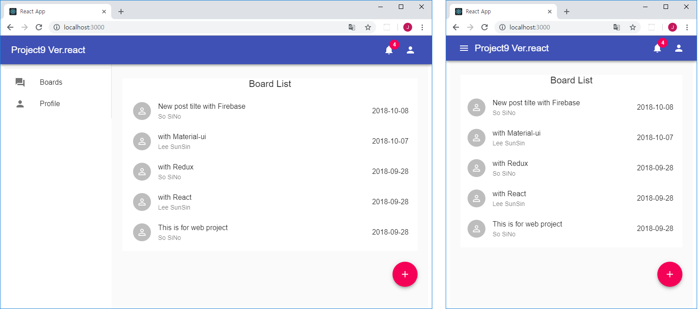

## project templete based on React(Redux) + Firestore + Material-ui ##

This is a web project template based on React(Redux), [Firestore](https://firebase.google.com/docs/) and [Material-ui](https://material-ui.com/).

To make web development easier and faster, a variety of frequently used functions have been implemented in advance.

### FEATURES ###

- Design templete (Material-ui) : Drawer, Dialog, Snackbar ...
- Simple Board, User Profile, Login
- Firebase: Auth, Storage, Firestore

### Other Examples ###

- [react_board](https://github.com/gujc71/react_board): simple board(CRUD) examples for React
- [redux_board](https://github.com/gujc71/redux_board): simple board(CRUD) examples for React + Redux
- [react_firestore](https://github.com/gujc71/react_firestore): simple board(CRUD) examples for React(Redux) + Firestore
- [firebaseExample](https://github.com/gujc71/firebaseExample): simple board(CRUD) examples for Node.js(express): + Firestore
- [DirectTalk9 ver.web](https://github.com/gujc71/DirectTalk9_web): A messenger app for React + Firebase based on this template (Project9).

### Install & Run ###

- git clone https://github.com/gujc71/project9_react.git
- npm install
- set config for [firebase](https://firebase.google.com/docs/web/setup?authuser=0) in Firestore.js 
- enable services(Auth, Storage, Firestore) in the firebase console.
- npm start

### License ###
MIT